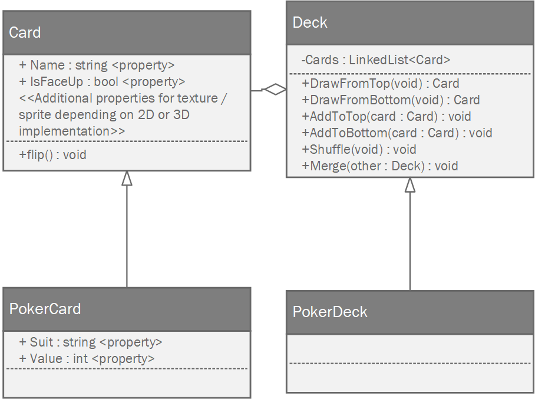

# Milestone #3
In this "mini" milestone, you will be refactoring your deck of cards into a more coherent object-oriented design that will be used in later projects.  

## Basic Functional Requirements
1. You implement the class diagrams as specified (**NOTE** currently this is a "pre release" diagram that will be revised by 2/19/2020)


## Basic Design Requirements 
1. You have a basic Unity project that allows you to test your classes.  All you need for this is four buttons: "Draw from bottom", "Draw from top", "Shuffle", and "Add Deck".  These buttons can then trigger console output using the ```Debug.Log()``` function.

### Advanced Design Requirements
1. Clicking buttons instead renders the cards on the screen using 2D sprites or 3D objects (your choice)

## Grading
This assignment is worth 50 points.  Your grade will be based on the following:
* Completing the basic Functional and Design requirements or making reasonable substitutions from the advanced feature list (check with me first!)
* Using the ```LinkedList``` data structure for your deck of cards
* Regular, appropriately sized github checkins (no single-line checkins, no 1000+ line checkins)
* Maintaining a [design diary](../design_diary_prompts.md) for this assignment (place in the root of your project repository)

## Due Date
This assignment is due midnight, February 28, 2020.  You will turn in your project by checking your code into github and by submitting a link to that repository on Canvas. Next, create an GIF walkthrough of your program using [LICEcap](https://www.cockos.com/licecap/).  Upload this image to your repository and put a link to the image in your reflection. *Be sure to place your reflection in _the root folder_ of your repository!* 
