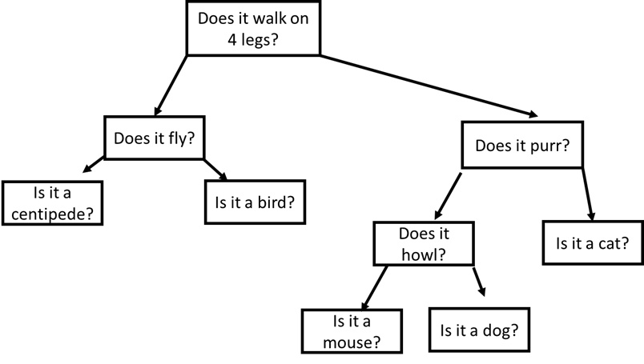
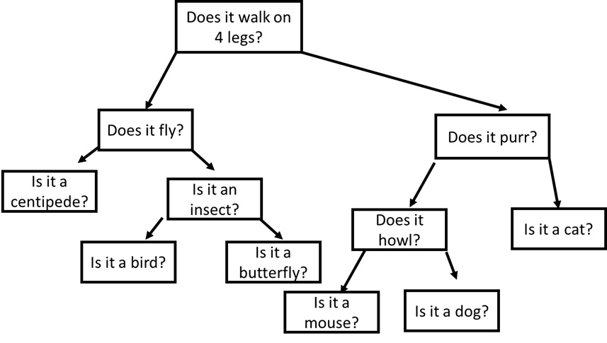

# Milestone #4
In this milestone, we will use search trees in your game through one of two options: by building a simple guessing game or by incorporating a decision tree into a game of your choosing.  

# Guessing Game
If you choose this route, you will build a "yes/no" animal guessing game using a binary tree.  In this scenario, each tree node represents a question with the left child representing the response to a "no" and the right child representing the response to a "yes."  In building this structure, you will find that you can quickly build an "intelligent" guesser.  Here's the basic flow of the game:

Until we reach a leaf node:
* Output the value of the node (i.e. next question to ask, "e.g. does it have fur?")
    * If the user's response is "yes", pull the next question from the right child
    * If the user's response is "no", pull the next question from the left child

Once at a leaf node:
* Read the value of the leaf node, which should be a question (e.g. "is it a dog?")
    * If the answer is yes, output that you win and that the game is over
    * If the answer is no:
        * Ask the user for the correct answer (e.g. "cat")
        * Ask the user for a new question, "What is a question that I can use to differentiate between my guess and your answer" (example response, "does it purr?")
        * Remember the question and the answer, restructure tree accordingly

## Graphical Example
The textual example might be a bit hard to follow, so consider the following tree:



In the example above, the game always starts by asking whether or not the animal walks on 4 legs.  If the answer is yes, it will next ask if the animal purrs.  Otherwise, it will ask if the animal flies.  If the answer is yes, the game will guess bird because that is a leaf node.  If that is the correct answer the game is over.  However, if we instead were thinking about a butterfly, the game would prompt us for the correct answer and a differentiating question.  Thus, after one game, our tree might look like the following:



As you will soon see, your game starts to become very smart very quickly.  How quickly can you get it to guess most animals given to you by friends?  

## Storing your tree
In order to build large trees, you will need to save and load your tree from a file.  The easiest way to do this is to perform a pre-order traversal and write the results to a file.  For example, a pre-order walk of the tree above would produce the following file:
```
Does it walk on 4 legs?
Does it fly?
*centipede?
Is it an insect?
*bird?
*butterfly?
Does it purr?
Does it howl?
*mouse?
*dog?
*cat?
```

# Adding a Decision Tree to a Custom Game
Because this option is a little more open, there is less that I can write about.  However, included with this project is example code that shows you how you might develop question nodes to be used in your program.  I will go over the code in more detail in class.  

## File format
Fortunately, the same file format used in the guessing game can be used in this version of the game as well.  Again, I mark leaf nodes with asterisks (*) as this allows us to properly to reconstruct the tree using an in-order traversal.  

## Basic Functional Requirements
1. You implement your chosen decision tree project in a in a non-Unity C# project.
2. You are able to save your decision tree to a file
3. You are able to load your decision tree from a file

### Advanced Functional Requirements
1. You implement your chosen assignment in Unity

## Grading
This assignment is worth 100 points.  Your grade will be based on the following:
* Completing the basic Functional requirements will net you a good grade, but to receive 100% you will need to implement the advanced functional requirements. 
* Using the Binary Tree data structure when appropriate
* Regular, appropriately sized github checkins (no single-line checkins, no 1000+ line checkins)
* Maintaining a [design diary](../design_diary_prompts.md) for this assignment (place in the root of your project repository)

## Due Date
This assignment is due midnight, March 24, 2020.  You will turn in your project by checking your code into github and by submitting a link to that repository on Canvas. Next, create an GIF walkthrough of your program using [LICEcap](https://www.cockos.com/licecap/).  Upload this image to your repository and put a link to the image in your reflection. *Be sure to place your reflection in _the root folder_ of your repository!* 
