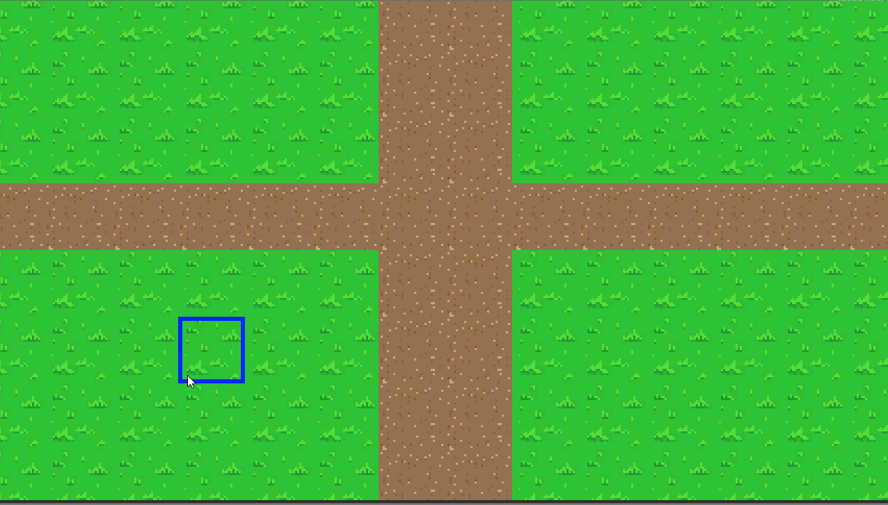

# Milestone #5
In this milestone, you will implement basic pathfinding in unity using Dijkstra's Algorithm.  Most of the code has been provided for you.  For basic credit, all you need to do is implement Dijkstra's algorithm inside of PathFinder.cs.  I have documented every bit of starter code in PathFinder.cs so be sure to read and understand that before you begin.  Note that all of your code should be placed inside of the DiscoverPath function.

## Dijkstra's Algorithm
The [Single Source Shortest Path](https://opendsa-server.cs.vt.edu/ODSA/Books/CS3/html/GraphShortest.html#single-source-shortest-paths) page on the OpenDSA website describes Dijkstra's algorithm and provides a pseudocode implementation that you may use.   Below, I provide a textual description of the algorithm:

1. Add starting location to a priority queue
2. While the priority queue is not empty and while you have not reached your final tile:
    * Pop the top item off of the priority queue
    * If the item contains the final tile in the path, you are done.
    * If not, for each of the tile's neighbors (there should be 4 since we're using square tiles)
        * Create a new path with the additional tile.  
        * If that path contains the final tile, you're done.
        * If not, add that path back into the Priority Queue.
3. Return the path discovered in Step #2 back to the caller.

## Samples
Included in this repository is an executable of my implementation for you to play around with.  If you are on a non-Windows machine, I also recorded a demo gif of my pathfinding in action:

## Basic Functional Requirements
1. You correct implement pathfinding using Dijkstra's algorithm

### Advanced Functional Requirements
1. You add additional tiles with different weights (I already provide a tile map)
2. You add blocking terrain (e.g. rocks, water)
3. You add a character that moves to the location using the path drawn after you click the mouse
4. Adding anything else that you think might be cool.

## Grading
This assignment is worth 100 points.  Your grade will be based on the following:
* Completing the basic Functional requirements will net you a good grade, but to receive 100% you will need to implement the advanced functional requirements. 
* Regular, appropriately sized github checkins (no single-line checkins, no 1000+ line checkins)
* Maintaining a [design diary](../design_diary_prompts.md) for this assignment (place in the root of your project repository)

## Due Date
This assignment is due midnight, April 17, 2020.  You will turn in your project by checking your code into github and by submitting a link to that repository on Canvas. Next, create an GIF walkthrough of your program using [LICEcap](https://www.cockos.com/licecap/).  Upload this image to your repository and put a link to the image in your reflection. *Be sure to place your reflection in _the root folder_ of your repository!* 
